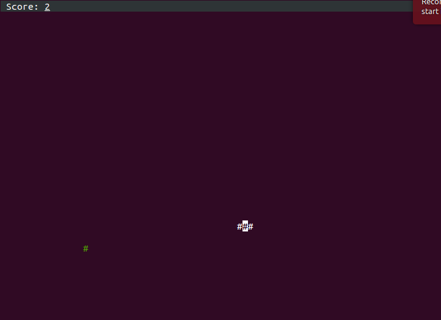

# greedy-snake

greedy snake game on terminal.



## Installation

```bash
$ npm install greedy-snake -g
```

## Play

```bash
$ greedy-snake [speed]
```

### Options

 * speed -- the speed of of the snake, will be passed to the `setInterval` function

## License

MIT

---

Copyright(c) 2014 Towry Wang <http://towry.me>
